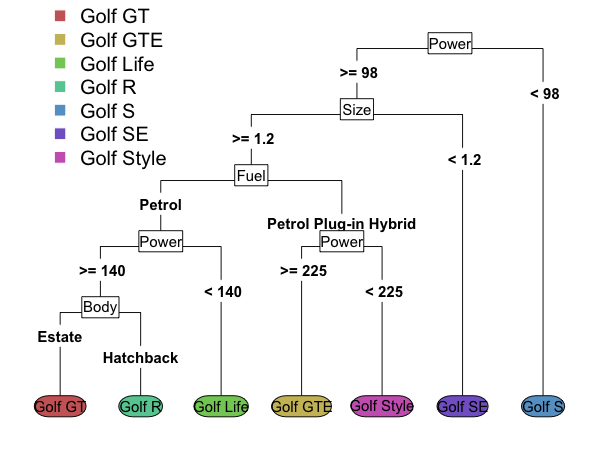

# Classifying Cars

Classification is guessing the category something belongs to, based on rules built from training data where we had previous examples of each category. 

One kind of classifier is a decision tree. 
Rules are created that allocate the item into a category based on the information we have about it. 
A classifier can be used to predict the class for new records.

While it might seem that cars are all fairly similar, there can actually be a lot of variability even within a model.

